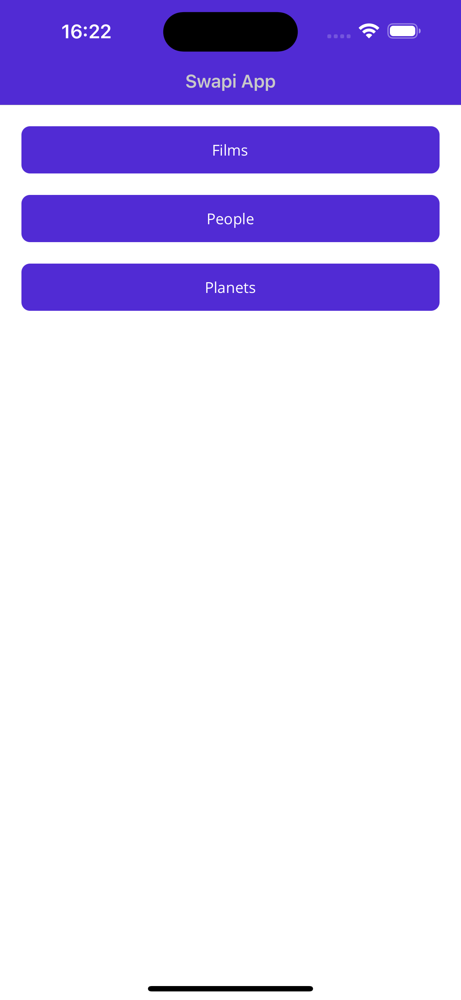
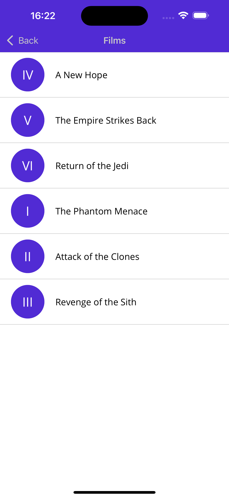
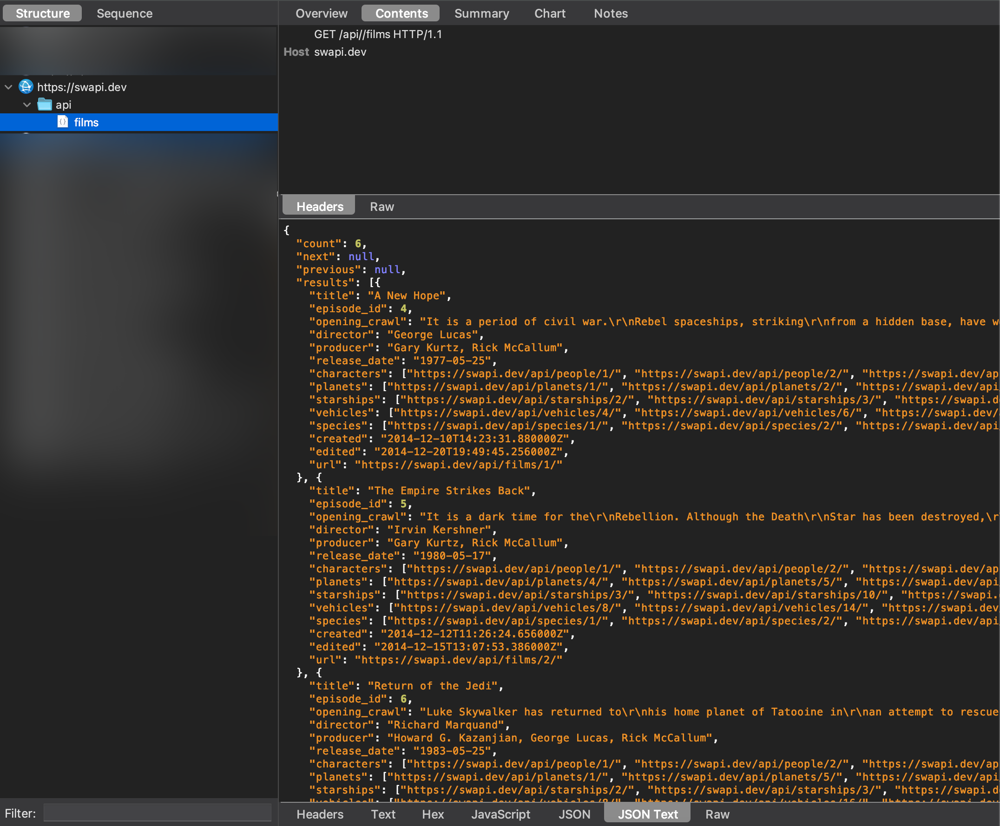

# Swapi Maui Sample

Sample maui app built to demonstrate using a proxy such as Charles to debug web requests from a maui app.

The sample app is not fully implemented yet, currently only films has any ui to show the api call result. Api calls are extremely slow so I have implemented a caching layer using `Microsoft.Extensions.Caching` to save web results.

|  |  |
| ------------------------------------------- | ------------------------------------------- |

## Setup

- You must have charles proxy setup on your machine.
- Ensure all urls are correct (these might be different for my machine than yours), ensure `<UseProxy>true</UseProxy>` (set to `false` to test app without traffic inspection).
- Build & run

## iOS

I have this working on iOS, you need to uncomment the setup code for this to work.

The one caviat is that iOS cannot use the native `NSURLSessionHandler` in maui (this did work in Xamarin), see [this issue](https://github.com/xamarin/xamarin-macios/issues/18635). Instead you have to use the dotnet handler, this is quite annoying and essentially makes adding proxies as a feature to iOS maui apps dead until this gets changed.

## Android

I haven't demonstrated this from this sample app. I need to setup my emulator with an access point to demonstrate it working correctly.