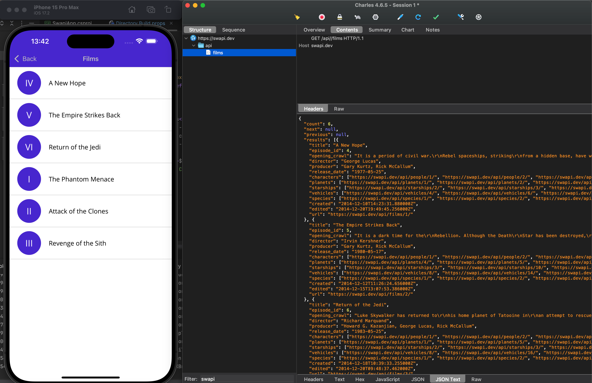
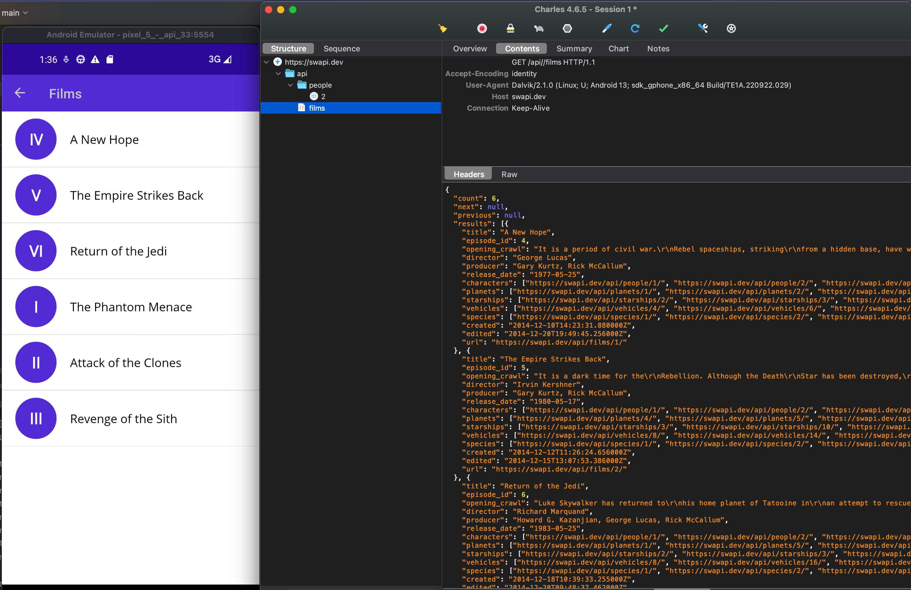

# Swapi Maui Sample

Sample maui app built to demonstrate using a proxy such as Charles to debug web requests from a maui app.

The sample app is not fully implemented yet, currently only films has any ui to show the api call result. Api calls are extremely slow so I have implemented a caching layer using `Microsoft.Extensions.Caching` to save web results.

|  |  |
| ------------------------------------------- | ------------------------------------------- |

## Setup

- You must have charles proxy setup on your machine.
- Ensure all urls are correct (these might be different for my machine than yours), ensure `<UseProxy>true</UseProxy>` (set to `false` to test app without traffic inspection).
- Build & run

## iOS

There is some jank with the iOS implementation. You cannot use the native `NSURLSessionHandler` in maui (this did work in Xamarin), see [this issue](https://github.com/xamarin/xamarin-macios/issues/18635). Instead you have to use the dotnet handler, this is quite annoying and essentially makes adding proxies as a feature to iOS maui apps dead until this gets changed.

The iOS proxy code changes are automatically handled in this sample, see the [csproj](https://github.com/Axemasta/SwapiMaui/blob/4c1eebb8762fbb9463296a0358ccd75ebe734b69/src/SwapiApp/SwapiApp.csproj#L56) & [conditional compile](https://github.com/Axemasta/SwapiMaui/blob/cb8316da4eee6cda4332fea49732e260103e7463/src/SwapiApp/MauiProgram.cs#L33).

## Android

Setup your emulator as described in [this guide](https://gist.github.com/twaddington/54eda4951fd8d2e858b537bef5f22334).

There is no other code changed needed to get traffic inspection working.

